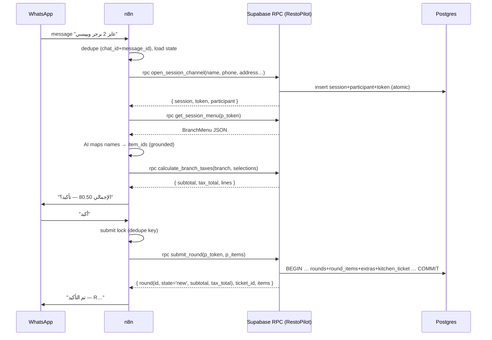

# WhatsApp (n8n) ↔ RestoPilot — API / Integration Contract

**Status**: Design & analysis document — nothing in it has been implemented.
**Scope**: How an n8n WhatsApp bot should call RestoPilot for every ordering
operation, based on what the RestoPilot codebase actually contains today.
**Date**: 2026-10-05. Evidence: `src/features/**` clients, `src/types/database.types.ts`,
and the migrations under `supabase/migrations/`.

---

## 0. The single most important finding

**RestoPilot has no HTTP API layer at all.** There are:

- No Express/Fastify/Next.js API routes.
- No Supabase Edge Functions (`docs/production-runbook.md` §4 item 8:
  "Edge Functions: **n/a** — the product uses none; all trusted logic is
  PostgreSQL functions").
- No frontend `fetch`/`axios` calls to a RestoPilot backend. The only `fetch`
  in the repo is a perf-baseline script hitting a Storage signed URL.

Every operation — customer sessions, menus, carts, orders ("rounds"), staff
lifecycle, tax, reports, audit — is a **PostgreSQL function (RPC) exposed by
Supabase's PostgREST Data API**, invoked from React clients via
`supabase.rpc('fn_name', { p_... })` with the publishable (anon) key.

This means "call the RestoPilot API" from n8n today can only mean one of:

1. Call the existing PostgREST `/rest/v1/rpc/<fn>` endpoints directly
   (works only for the **anon-reachable, token-authorized** customer RPCs), or
2. Build a new API layer (the recommended path — see §9 and §13).

The architecture intent (Master Plan §4.1) is explicitly:

```
WhatsApp → n8n → RestoPilot API → Supabase (Postgres RPCs)
```

and the Master Plan (§31) reserves Edge Functions / server runtime for
"external integrations, secret-bearing operations, webhooks" — which is
exactly what a WhatsApp bot integration is.

### The transport that exists today (REAL)

All existing operations are callable as:

```http
POST {VITE_SUPABASE_URL}/rest/v1/rpc/<function_name>
Content-Type: application/json
apikey: <publishable key>

{ "p_token": "...", "p_items": [...] }
```

- **Base URL**: the Supabase project URL (same one in `VITE_SUPABASE_URL`).
- **Auth**: `apikey` header with the publishable key + PostgREST's
  `Authorization: Bearer <jwt>` when a logged-in user's role is required.
- **Status mapping**: a PostgreSQL `P0001` refusal comes back as
  **HTTP 400** with `{ "code": "P0001", "message": "<server's message>", ... }`;
  an authorization failure (`42501`) also arrives as **400** with code
  `42501` (PostgREST maps DB errors to 400/500 — there are no 403/404/422
  REST semantics on this surface; the frontend maps codes, not HTTP verbs).
- **Money on the wire**: canonical decimal **strings** ("19.90"), never
  floats — this is enforced project-wide (`menuClient.ts`, `taxMoney.ts`).

Everything below marks each operation `EXISTING` (callable on this transport
today), `PROPOSED` (must be built), or `NOT RECOMMENDED`.

---

## 1. Status vocabulary

| Status                | Meaning |
| --------------------- | ------- |
| `EXISTING`            | The RPC is deployed in a migration and reachable today via PostgREST `/rest/v1/rpc/...`. |
| `PARTIALLY EXISTING`  | The core engine exists (RPC/service), but a caller-facing wrapper (service auth, n8n-shaped payload) must be built on top. |
| `PROPOSED`            | Does not exist anywhere in the codebase. Requires implementation. |
| `NOT RECOMMENDED`     | Operation must not be executed by n8n directly (do it via RestoPilot, or don't do it at all). |

---

## 2. Operations the WhatsApp bot needs — catalog

The bot's real work decomposes into 12 operations:

| # | Operation | Status | RestoPilot today |
| - | --------- | ------ | ---------------- |
| 1 | Resolve restaurant by identifier | `EXISTING` | `get_public_restaurant(p_slug)` |
| 2 | Open/join a session (dine-in) | `EXISTING` | `open_session_at_table(...)` |
| 3 | Open a session (delivery/takeaway) | `EXISTING` | `open_session_channel(...)` |
| 4 | Verify session / read context | `EXISTING` | `get_session_context(p_token)` |
| 5 | Retrieve menu + availability | `EXISTING` | `get_session_menu(p_token)` |
| 6 | Authoritative price preview | `EXISTING` | `calculate_branch_taxes(branch_id, selections)` |
| 7 | Submit order (create round) | `EXISTING` | `submit_round(p_token, p_items)` |
| 8 | Read order history for session | `EXISTING` | `get_session_rounds(p_token)` |
| 9 | Modify order line (reduce/remove) | `NOT RECOMMENDED` | `modify_round_line` is staff-only (JWT role check); customer/self-service modify does not exist |
| 10 | Cancel/void order | `NOT RECOMMENDED` | `void_round` is staff-only, audited, boundary-gated; no customer path |
| 11 | Order status follow-up | `PARTIALLY EXISTING` | `get_session_rounds` shows customer's own rounds incl. `state`; a status-focused projection would be a small wrapper |
| 12 | Customer identification/lookup by phone | `PROPOSED` | Nothing exists — participants are display-only rows inside a session; no lookup, no dedupe, no CRM |

Detailed contracts per operation follow. **For all `EXISTING` entries the
HTTP shape is the PostgREST RPC call shown in §0; bodies and responses are
copied from the migrations and the typed clients verbatim.**

---

## 3. Detailed operation contracts

### 3.1 Resolve restaurant by identifier

**Name**: `Get Public Restaurant`
**Status**: `EXISTING`
**Purpose**: Turn "the restaurant the bot is bound to" (or a customer's first
message naming a venue) into `{ restaurant_id, branches[] }` so every later
call is tenant-scoped.

**HTTP Method**: `POST`
**URL**: `{SUPABASE_URL}/rest/v1/rpc/get_public_restaurant`
**Authentication**: Publishable key (`apikey` header). Anon role — no user
session needed. This RPC is granted to `anon, authenticated`.
**Authorization**: None beyond lookup-by-slug; the RPC only returns the
restaurant's public profile and its **active** tables. Tenant isolation is
irrelevant here because the payload is the tenant selector itself.

**Request headers**:

```http
Content-Type: application/json
apikey: <publishable-key>
```

**Request body**:

```json
{ "p_slug": "blue-olive" }
```

**Response (200)** — exact shape from `session_rpcs.sql` / `parsePublicRestaurant`:

```json
{
  "restaurant": { "id": "00000000-0000-4000-8000-000000000001", "name": "Blue Olive", "slug": "blue-olive", "brand_description": "Wood-fired Mediterranean plates..." },
  "branches": [
    { "id": "...", "name": "Downtown", "tables": [ { "id": "...", "label": "T1" } ] }
  ]
}
```

**Error responses**:

- HTTP 400 `{"code":"P0001","message":"Restaurant not found."}` — unknown slug.
- HTTP 400/500 with other codes — transport/infra failure ⇒ retryable.

**Idempotency**: Pure read — safe to repeat.
**Retry safety**: Yes.
**Transactionality**: n/a (single stable read).
**Audit / Logging**: n/a on server; n8n should log slug → restaurant_id mapping.

---

### 3.2 Open a dine-in session at a table

**Name**: `Open Dine-in Session`
**Status**: `EXISTING`
**Purpose**: For a bot conversation rooted at a table QR: create the session
(or join the already-open one — open-or-join semantics are inside the RPC)
and obtain the **session token** that authorizes all later customer calls.

**HTTP Method**: `POST`
**URL**: `{SUPABASE_URL}/rest/v1/rpc/open_session_at_table`
**Authentication**: Publishable key; anon role. Granted to `anon, authenticated`.
**Authorization**: The RPC validates restaurant → branch → active-table
coherence itself (P0001 refusals otherwise). Tenant scoping is a *parameter
chain* here — n8n must pass ids it obtained from op 3.1, never customer text.

**Request body**:

```json
{
  "p_restaurant_id": "00000000-0000-4000-8000-000000000001",
  "p_branch_id": "...",
  "p_table_id": "...",
  "p_display_name": "Yousef",
  "p_phone": "+966501234567"
}
```

Validation inside the RPC: name 1–60 chars, phone matches `^\+?[0-9]{7,15}$`
(note: the **dine-in** RPC enforces this strict phone regex; the
**channel** RPC below is looser — up to 20 chars).

**Response (200)** — the token is shown **once**:

```json
{
  "session": {
    "id": "…", "restaurant_id": "…", "branch_id": "…", "table_id": "…",
    "type": "dine-in", "status": "open", "opened_at": "2026-10-05T12:00:00Z", "delivery_address": null
  },
  "token": "base64url-32-bytes",
  "participant": { "id": "…", "display_name": "Yousef", "joined_at": "…" }
}
```

**Error responses** (all HTTP 400, code `P0001`, message verbatim):
"Restaurant not found." / "Branch not found." / "Table not found." /
"A display name is required." / "A display name may be at most 60 characters." /
"A valid phone number is required." / "A session is already open at this table. Join it instead."
(the last one happens only on a lost race; open-or-join handles the normal case).

**Idempotency**: The RPC is **not** idempotent by key — each call inserts a
participant + a new token. n8n **must** persist the returned token in its own
conversation state keyed by WhatsApp chat id and never call this twice for the
same active conversation (dedupe at the workflow level; see §8).
**Retry safety**: Only as a retry-if-no-response-at-all with the dedupe rule
above; a duplicate call adds a duplicate participant row, not a duplicate
session (the partial unique index keeps one open session per table).
**Transactionality**: Atomic inside the RPC.
**Audit / Logging**: Session/participant rows are the record; n8n must not
log the raw token (it equals session access).

---

### 3.3 Open a delivery / takeaway session

**Name**: `Open Channel Session`
**Status**: `EXISTING`
**Purpose**: The **primary entry for a WhatsApp bot** — a WhatsApp
conversation is naturally a delivery or takeaway channel with no table.

**HTTP Method**: `POST`
**URL**: `{SUPABASE_URL}/rest/v1/rpc/open_session_channel`
**Authentication / Authorization**: same posture as 3.2; granted to
`anon, authenticated`. Validation: channel ∈ {delivery, takeaway} (dine-in is
refused here: "Choose delivery or takeaway."), name 1–60, phone ≤ 20 chars,
address 1–200 chars required **only** for delivery; takeaway ignores address.
Note: the `session_participants_phone_check` table constraint applies on
**both** entry paths, so the stored phone must still match
`^\+?[0-9]{7,15}$` — a looser channel-RPC phone fails the insert as a
check violation (23514 ⇒ the generic retry message on the frontend), not a
friendly P0001.

**Request body**:

```json
{
  "p_restaurant_id": "00000000-0000-4000-8000-000000000001",
  "p_branch_id": "...",
  "p_channel": "delivery",
  "p_display_name": "Yousef",
  "p_phone": "+966501234567",
  "p_delivery_address": "King Fahd Rd, Riyadh"
}
```

**Response (200)**: identical `{ session, token, participant }` shape as 3.2
(`session.table_id` is `null`; `session.type` is `delivery` or `takeaway`;
`delivery_address` echoed read-only — there is **no write path to change the
address after entry**; that would be a `PROPOSED` operation if you want
"change my address" mid-conversation).

**Error responses** (HTTP 400 `P0001`, verbatim): "Restaurant or branch not
found." / "Choose delivery or takeaway." / "Enter your name (1–60
characters)." / "Enter your phone number (up to 20 characters)." / "A
delivery address is required."

**Idempotency**: Same rule as 3.2 — every call opens a NEW session (channel
sessions have no uniqueness constraint). n8n owns dedupe: one open session
per WhatsApp chat, stored in conversation state. A "new order" command maps
to calling this again; "continue" maps to reusing the stored token.
**Retry safety**: Same as 3.2.
**Transactionality**: Atomic inside the RPC.
**Audit / Logging**: session/participant rows; don't log tokens.

---

### 3.4 Verify session / read context

**Name**: `Get Session Context`
**Status**: `EXISTING`
**Purpose**: Liveness check + tenant anchor: confirm the stored token still
refers to an open session, and read `{ restaurant_id, branch_id, type }`
without asking the customer anything.

**HTTP Method**: `POST`
**URL**: `{SUPABASE_URL}/rest/v1/rpc/get_session_context`
**Authentication**: publishable key; the *token parameter is the
authorization* (SHA-256 hashed and matched server-side; only the hash is
stored — `session_tokens` has zero client grants).
**Authorization**: Token-derived; a token can only ever address its own
session/restaurant. This is the tenant-isolation mechanism for the whole
customer surface.

**Request body**: `{ "p_token": "<session token>" }`

**Response (200)**:

```json
{
  "session": { "id": "…", "restaurant_id": "…", "branch_id": "…", "table_id": null,
               "type": "delivery", "status": "open", "delivery_address": "…", "opened_at": "…" },
  "indicator": { "restaurant_name": "Blue Olive", "branch_name": "Downtown", "table_label": null },
  "participants": [ { "id": "…", "display_name": "Yousef", "joined_at": "…" } ]
}
```

**Error responses**: HTTP 400 `P0001` "This session is no longer available."
— unknown token, tampered token, and closed session are **deliberately
indistinguishable**. On this message n8n must drop the stored token and
restart the conversation flow.

**Idempotency**: Read — safe.
**Retry safety**: Yes.
**Audit**: n/a.

---

### 3.5 Retrieve menu + availability

**Name**: `Get Session Menu`
**Status**: `EXISTING`
**Purpose**: The **only** legitimate source of items, extras, prices, and
availability for the bot. The AI's product vocabulary must be grounded in
this payload (fuzzy name → `item_id` mapping happens in n8n, but prices and
`is_offered` come from here).

**HTTP Method**: `POST`
**URL**: `{SUPABASE_URL}/rest/v1/rpc/get_session_menu`
**Authentication / Authorization**: token-authorized like 3.4 (session must
be open). Granted to `anon, authenticated`.

**Request body**: `{ "p_token": "<session token>" }`

**Response (200)** — canonical `BranchMenu` payload (fields per
`menuClient.parseBranchMenu`):

```json
{
  "branch": { "id": "…", "name": "Downtown" },
  "restaurant": { "id": "…", "name": "Blue Olive", "slug": "blue-olive" },
  "categories": [
    {
      "id": "…", "name": "Burgers", "description": null, "sort_order": 1,
      "items": [
        {
          "id": "…", "name": "Burger", "description": "…",
          "price": "35.00", "sort_order": 1, "image_path": null,
          "is_offered": true, "unavailable_reason": null,
          "extras": [ { "id": "…", "name": "Cheese", "price_adjustment": "3.00", "sort_order": 1 } ]
        }
      ]
    }
  ]
}
```

Key semantics for the bot: `is_offered: false` items exist in the payload
but carry `unavailable_reason: 'restaurant' | 'branch'` — the bot must not
offer them, and `submit_round` will refuse them anyway
("This item is not available here."). **Prices are strings**; never convert
to float in the workflow.

**Error responses**: HTTP 400 `P0001` "This session is no longer available."
**Idempotency**: Read — safe. **Retry**: yes. **Audit**: n/a.

---

### 3.6 Authoritative price preview

**Name**: `Calculate Branch Taxes (preview)`
**Status**: `EXISTING`
**Purpose**: Show the customer the exact price (subtotal + tax lines + total)
**before** submitting, using the same engine the submission uses — so the
preview and the captured money can never diverge.

**HTTP Method**: `POST`
**URL**: `{SUPABASE_URL}/rest/v1/rpc/calculate_branch_taxes`
**Authentication**: **This is a staff-granted RPC.** It is revoked from
`public, anon` and granted only to `authenticated` — the caller must present
a Supabase user JWT (`Authorization: Bearer <jwt>`, `apikey` header still
required). There is no service account in the project today (see §9, Open
Questions). `calculate_branch_taxes` itself performs **no role check**
(42501 refusals come only from other staff RPCs) — the grant is the gate.

**Request body** — `p_selections` is a JSON **array** (not a stringified
one — the client documents that PostgREST delivers a JS string argument as a
jsonb scalar and the engine rejects that):

```json
{
  "p_branch_id": "…",
  "p_selections": [
    { "item_id": "…", "extras": [ { "extra_id": "…" } ], "quantity": "2" }
  ]
}
```

**Response (200)** — `TaxCalculation` shape:

```json
{
  "lines": [
    { "rule_id": "…", "name": "VAT", "rate": "0.1500", "scope": "total",
      "sort_order": 1, "amount": "10.50" }
  ],
  "subtotal": "70.00",
  "total": "80.50"
}
```

**Error responses**: HTTP 400 `P0001` engine validation messages (malformed
selections, unknown ids at engine discretion); 400 `42501`-shaped errors only
from the surrounding grant mechanics.
**Idempotency**: Pure function of (branch, selections) — safe to repeat.
**Retry safety**: Yes.
**Audit**: none for this read path (tax snapshots are a separate, staff,
once-only flow — not relevant to the bot).

---

### 3.7 Submit order (create the round)

**Name**: `Submit Round`
**Status**: `EXISTING`
**Purpose**: The **order creation** — the whole conversation converges here.
One call atomically validates the cart, re-checks availability, computes tax
via the privileged engine, writes the round + its items + extras + kitchen
ticket, and captures authoritative money.

**HTTP Method**: `POST`
**URL**: `{SUPABASE_URL}/rest/v1/rpc/submit_round`
**Authentication**: publishable key; **token-authorized** (session must be
open). Granted to `anon, authenticated`.
**Authorization**: Token → session → (restaurant_id, branch_id) are derived
server-side in one step; a round can never be written against another
restaurant. Cart/selection ids are validated to belong to that restaurant.
Prices are **captured from the menu tables at call time** — n8n never sends
prices (there is no price field to forge; this kills the biggest bot risk).

**Request body** — `p_items` is an array of lines; quantity is an integer
**as a string**; extras may be id strings or `{extra_id}` objects; ≤ 50
lines, 1–99 quantity, ≤ 20 extras per line, no duplicate extras per line,
duplicate items merge:

```json
{
  "p_token": "<session token>",
  "p_items": [
    { "item_id": "…", "extras": ["…", {"extra_id": "…"}], "quantity": "2" }
  ]
}
```

**Response (200)** — `SubmitRoundPayload`:

```json
{
  "round": {
    "id": "…", "restaurant_id": "…", "branch_id": "…", "session_id": "…",
    "state": "new",
    "subtotal": "70.00", "tax_total": "10.50",
    "tax_lines": [ { "rule_id": "…", "name": "VAT", "rate": "0.1500", "scope": "total", "sort_order": 1, "amount": "10.50" } ],
    "created_at": "…"
  },
  "ticket_id": "…",
  "items": [
    {
      "id": "…", "item_id": "…", "quantity": 2, "unit_price": "35.00",
      "extras": [ { "extra_id": "…", "price_adjustment": "3.00" } ]
    }
  ]
}
```

**Error responses** (HTTP 400 `P0001`, verbatim from the migration):
"A cart line is required." / "A cart line is malformed." /
"A quantity must be between 1 and 99." / "This item is not available here." /
"An extra does not belong to its item." / "This session is no longer
available." / channel cutoffs: delivery — "Your order is already on its way —
no additional items can be added."; takeaway — "Your order is ready for
pickup — no additional items can be added." (dine-in has no cutoff).

**Idempotency**: **Not idempotent.** Every successful call creates a new
round. There is no `idempotency_key` parameter anywhere. This is the single
most dangerous property for a WhatsApp bot (webhook redeliveries, n8n
retries, WhatsApp re-sends). **Mitigation belongs in n8n**: a
conversation-scoped submit lock (e.g. Redis/Postgres-backed dedupe node
keyed on `chat_id + message_id + 'submit'`) so the RPC fires at most once
per confirmed customer message; plus the §8 confirm-before-submit flow.
**Retry safety**: Retry only on transport-level failure with **no response**
(then still verify via 3.8 whether the round landed before resubmitting).
Never blind-retry a timeout after a 200 was seen.
**Transactionality**: Fully atomic — round + items + extras + ticket are one
transaction; any refusal leaves zero rows.
**Audit / Logging**: Round/ticket rows are the business record. n8n should
log chat_id, message_id, round id, and the totals it displayed — never
tokens, never customer PII beyond what the conversation needs.

---

### 3.8 Read the session's order history

**Name**: `Get Session Rounds`
**Status**: `EXISTING`
**Purpose**: Recover state after restarts, show the customer their rounds,
and **verify** whether a timed-out submit actually landed (retry-safety
probe).

**HTTP Method**: `POST`
**URL**: `{SUPABASE_URL}/rest/v1/rpc/get_session_rounds`
**Authentication / Authorization**: token-authorized; granted `anon, authenticated`.

**Request body**: `{ "p_token": "<session token>" }`

**Response (200)** — `RoundsPayload`; each round carries `state`
(`new|accepted|preparing|ready|out_for_delivery|completed|lock`), `subtotal`,
`tax_total`, `tax_lines`, items with names and captured prices:

```json
{
  "rounds": [
    {
      "id": "…", "state": "preparing", "subtotal": "70.00", "tax_total": "10.50",
      "tax_lines": [], "created_at": "…",
      "items": [
        { "id": "…", "item_id": "…", "name": "Burger", "quantity": 2,
          "unit_price": "35.00",
          "extras": [ { "extra_id": "…", "name": "Cheese", "price_adjustment": "3.00" } ] }
      ]
    }
  ]
}
```

**Error responses**: same single refusal as 3.4.
**Idempotency**: Read — safe. **Retry**: yes. **Audit**: n/a.

---

### 3.9 Modify an order line

**Name**: `Modify Round Line`
**Status**: `NOT RECOMMENDED` (as a direct n8n call) — see the `PROPOSED`
customer path below.
**Purpose**: "خلي البرجر 3 بدل 2" / "الغي البرجر".

(Detailed contract for the existing staff RPC, for completeness:)

What exists today: `modify_round_line(p_round_id, p_item_id, p_action, p_quantity)`
— `action ∈ {remove, reduce}` — is a **staff** operation:

- Granted to `authenticated` only (revoked from `public, anon`), refuses
  without a staff JWT (`42501`).
- Requires `cashier`/`branch_manager` reach over the round's branch
  (server-derived from the JWT).
- Refuses in frozen states (`ready`, `lock`) — and for delivery, once
  `out_for_delivery`/`completed` the cutoffs make the session effectively
  closed to additions anyway.
- Re-derives money from captured rows (never current menu prices) — good.

There is **no customer-owned modify path** and **no service-token path**.
n8n cannot safely call this: presenting a staff JWT to a public webhook
workflow violates the whole security posture (§9), and there is no
service account to impersonate.

**PROPOSED: `customer_modify_round`** (design suggestion — needs
implementation):

```
PROPOSED: POST {SUPABASE_URL}/rest/v1/rpc/customer_modify_round
```
or, better, behind the §9 API layer:

```
PROPOSED: POST /api/whatsapp/orders/{round_id}/lines
```

Suggested contract (token-authorized like `submit_round`):

```json
{ "p_token": "<session token>", "p_round_id": "…", "p_item_id": "…",
  "p_action": "reduce", "p_quantity": 3 }
```

Server-side rules to carry over from `modify_round_line`: only when the
round is not yet `ready`/beyond; re-derive money from captured rows; same
P0001 refusal vocabulary; audit with a bot actor. **This is a design
proposal, not existing behavior.**

**Idempotency**: `reduce` is idempotent-in-effect (setting the same quantity
twice converges); `remove` is idempotent (second call refuses harmlessly).
Still prefer the n8n dedupe key.

---

### 3.10 Cancel / void an order

**Name**: `Void Round`
**Status**: `NOT RECOMMENDED` for n8n.
**Purpose**: Customer says "ألغي الطلب كله".

What exists: `void_round(p_round_id, p_reason)` — staff-only, mandatory
reason (1–500 chars), cashier/manager role, **boundary-gated** (dine-in at
`lock`, delivery at `out_for_delivery`/`completed`, takeaway at `ready`),
audited (`round.void`), and an overlay (never touches `state`, so cutoffs
keep working). Unknown ids and wrong boundary share one generic refusal.

There is no customer-cancel path and no bot-actor path. Options:

1. `NOT RECOMMENDED` (default): the bot answers "I've asked the restaurant;
   they'll confirm" and a **human** voids from the staff surface. Safer:
   cancellation is a money-moving, boundary-sensitive, audited action.
2. `PROPOSED`: a `customer_request_cancel` operation that records a request
   (not a void) for staff approval — needs a new table + flow.

n8n must not call `void_round` even if a staff JWT were available: it would
put a role that can void paid orders behind a customer-text-driven webhook.

**Idempotency**: The RPC itself is idempotent-in-effect (re-void refuses).
**Retry**: n/a if not implemented. **Transactionality**: overlay + ticket
mirror update are one transaction. **Audit**: mandatory reason is stored.

---

### 3.11 Order status follow-up

**Name**: `Order Status`
**Status**: `PARTIALLY EXISTING`.
**Purpose**: "فين طلبي؟" — tell the customer their round states.

Today: `get_session_rounds` (3.8) already returns each round's `state` —
sufficient for the bot. Two caveats:

- It is the customer's **own session only** (token-scoped) — good isolation.
- There is no push/notify surface in RestoPilot (no webhooks out; Master Plan
  explicitly excludes notifications in V1). The bot must **poll** (e.g. an
  n8n schedule node keyed to active conversations) or answer only on demand.

`PROPOSED (optional)`: a `get_session_status_summary` wrapper returning just
`{ round_id, state, eta_hint }` — nice-to-have; `get_session_rounds` covers
the need.

---

### 3.12 Customer identification / lookup by phone

**Name**: `Identify Customer by Phone`
**Status**: `PROPOSED` — nothing in the codebase does this.
**Purpose**: "أهلاً من جديد" — recognize a returning WhatsApp number, greet
by name, prefill delivery address, per-restaurant.

Reality check from the code: `session_participants` is a **display-only**
row per session (name + phone captured at entry, `phone ~ '^\+?[0-9]{7,15}$'`,
retained indefinitely, no uniqueness, no customer id, no addresses table,
no CRM). Delivery address lives on the **session** row (once, immutable).

A safe shape would be an RPC in the API layer:

```
PROPOSED: POST /api/whatsapp/customers/resolve
{ "restaurant_id": "…", "phone": "+966…" }
→ 200 { "known": true, "display_name": "Yousef", "last_address": "…" }
   | { "known": false }
```

Requires implementation (a definer RPC reading `session_participants` +
past delivery sessions for the tenant) and a privacy decision (§14).

---

## 4. Direct Supabase access from n8n

### Allowed / Reasonable (using the publishable key only)

| Operation | Why acceptable |
| --------- | -------------- |
| `get_public_restaurant` | Public by design; payload is the tenant selector. |
| `open_session_channel` / `open_session_at_table` | Anon-reachable by design; the RPCs validate everything and return a scoped token. |
| `get_session_context` / `get_session_menu` / `get_session_rounds` / `submit_round` | The **session token is the authorization** — hashed lookup, tenant-derived server-side, zero table grants behind it. An n8n caller is exactly equivalent to a browser customer. |
| Reading Realtime channels (optional) | `rounds`/`kitchen_tickets` broadcasts are authorized per-session/branch; could drive "your order is ready" messages later. |

Important: these are allowed **because** they are the same anon surface the
public web app uses, and every one of them is server-authorized by a
capability token or pure-function lookup — not because "direct Supabase is
fine".

### Not Recommended (never from n8n)

| Operation | Why not |
| --------- | ------- |
| Table CRUD with `anon` key on RLS-open tables | Most product tables (`sessions`, `rounds`, `menu_*`, `tax_*`, …) have RLS enabled with **no policies** and all grants revoked — direct access fails closed. Any table that *is* readable by `anon` is readable only through the RPC contract above. |
| Anything with the `service_role` key from n8n | Bypasses RLS entirely, cross-tenant by construction, impossible to audit as a customer actor, and would sit in n8n credentials (a workflow editor is not a secrets vault). The project's own runbook forbids service-role keys in the bundle; the same reasoning applies harder to n8n. |
| Creating/updating orders by writing `rounds` / `round_items` / `round_item_extras` directly | Even with a privileged key: skips availability checks, tax capture, kitchen ticket creation, cutoff enforcement, and money capture invariants. `submit_round` is the only sanctioned writer. |
| Modifying orders (`modify_round_line`, `void_round`) directly | Staff-authorized, audited, boundary-gated operations; a bot must not hold staff credentials (§3.9–3.10). |
| Customer "business logic" (lookup, dedupe, profile updates) on raw tables | No such logic exists; inventing it in a workflow creates an unowned shadow model outside the DB's invariants. |
| Availability/inventory toggles (`set_menu_item_availability`, `set_branch_item_availability`) | Owner/manager operations. The bot must *read* availability via the menu projection and *never* change it. |
| Tax configuration (`create_tax_rule`, overrides, snapshots) | Owner-only surface; price truth must flow only through the engine. |
| Payment state | No payments exist in the product at all (V1 explicitly excludes online payment). There is nothing to touch; don't create shadow payment state. |
| Staff/platform management (`add_staff_member`, subscriptions, kill-switch) | Platform-admin/staff-only; catastrophic if exposed to a webhook surface. |

**Rule of thumb**: n8n touches Supabase directly only with the publishable
key and only through the five token-authorized customer RPCs + the public
lookup. Everything else goes through RestoPilot's own layer (to be built),
or doesn't happen.

---

## 5. n8n workflow mapping

Canonical flow:

```text
WhatsApp Trigger (webhook)
      ↓
Normalize Message (chat_id, message_id, text, media)
      ↓
Load Conversation State (n8n data store: chat_id → { token, restaurant_id, branch_id, last_round_id })
      ↓
Identify Restaurant (config/static per bot number — see Open Questions)
      ↓
AI Intent Detection (grounded on the menu payload + allowed intents)
      ↓
Guard/Validate extracted items (names → item_id/extras ids from menu only)
      ↓
HTTP Request → RestoPilot (RPC)  ← one call per operation, below
      ↓
Process Response (map codes P0001/42501 → customer-friendly text)
      ↓
WhatsApp Reply
```

Node-level mapping:

| n8n Node | Responsibility | RestoPilot operation |
| -------- | -------------- | -------------------- |
| WhatsApp Trigger (Webhook) | Receive inbound message; respond 200 immediately (queue the work) | — |
| Set/Code (Normalize) | Canonical chat_id + message_id; dedupe key | — |
| Data Store / Redis (Get) | Conversation state: session token, branch, pending cart | — |
| AI (LLM) node | Intent + slot extraction **grounded on menu JSON**; no db access, no tool-calling to Supabase | — |
| Code (Mapper) | Map extracted names → `item_id`/`extra_id` from the cached menu; reject unknowns | — |
| HTTP Request | Resolve restaurant | `get_public_restaurant` |
| HTTP Request | Open session (delivery/takeaway) | `open_session_channel` |
| HTTP Request | Open/join dine-in session | `open_session_at_table` |
| HTTP Request | Session liveness check | `get_session_context` |
| HTTP Request | Fetch/refresh menu cache | `get_session_menu` |
| HTTP Request | Price preview | `calculate_branch_taxes` (needs §9 service auth) |
| HTTP Request | **Create order** | `submit_round` |
| HTTP Request | History/status | `get_session_rounds` |
| Wait/Poll (schedule) | Status follow-up when customer asks | `get_session_rounds` |
| Code (Error map) | `P0001` message verbatim → friendly text; unknown → generic retry message | — |
| WhatsApp (Send) | Reply | — |
| Data Store (Set) | Persist token/round ids/state | — |

The error-mapping node should reuse RestoPilot's own vocabulary: `P0001`
messages are written for humans — surface them verbatim (that's what the
frontend does); treat everything else as "please try again".

---

## 6. WhatsApp ordering example — end to end

Customer (WhatsApp, bound to Blue Olive bot): **"عايز 2 برجر وبيبسي"**

1. **WhatsApp webhook** → n8n receives message from `chat_id` C.
2. **Dedupe/normalize**: key `C + message_id` — if seen before, ignore (webhook
   redelivery protection).
3. **Load state**: no token for C → this is a new conversation.
4. **Identify restaurant**: the bot number is bound to one restaurant
   (config): `restaurant_id` known; `branch_id` still needed.
5. **AI intent**: greeting + order intent; slots: name? phone? channel?
   Ask: "توصيل ولا استلام؟ ولأي فرع؟"
6. **Open session**: after answers, n8n calls
   `open_session_channel` (3.3) with the customer's name/phone/address.
   Response `token` stored in conversation state. *Every* later customer
   operation now uses this token.
7. **Menu grounding**: `get_session_menu` (3.5) → cache in state (TTL).
   AI maps "برجر" → `item_id` (menu says `is_offered: true`), "بيبسي" →
   its `item_id`. If a name is ambiguous or unavailable → clarify, never
   guess.
8. **Preview** (optional but recommended): `calculate_branch_taxes` (3.6)
   with the mapped selections → "الإجمالي 80.50 شامل الضريبة. تأكيد؟"
9. **Customer confirms** ("أكيد") → n8n takes the submit lock for
   (chat, this confirmation) — the anti-double-submit guard.
10. **Submit**: `submit_round` (3.7) with `p_token` + mapped `p_items`.
    RestoPilot validates availability, captures prices, computes tax,
    writes round + kitchen ticket atomically, returns authoritative
    `round.subtotal` / `tax_total`.
11. **Reply**: "تم تأكيد طلبك رقم R… الإجمالي 80.50 جاهز خلال ~20 دقيقة"
    (numbers quoted **only** from the RPC response — never from the AI).
12. Any `P0001` refusal → the mapped customer message ("This item is not
    available here." → "للأسف البرجر غير متاح الآن"), state kept.

Modification example: **"خلي البرجر 3 بدل 2"**

1. AI extracts: modify intent, item برجر, new quantity 3.
2. n8n loads state: last `round_id` = R, `round_items` from the submit
   response (or `get_session_rounds`) give the `item_id` for برجر.
3. There is **no customer modify RPC** (§3.9). With the recommended API
   layer, n8n calls `PROPOSED POST /api/whatsapp/orders/R/lines` (or the
   proposed token-authorized RPC). RestoPilot re-validates state, re-derives
   money from captured rows, and returns the updated round.
4. Without that layer: the bot must answer "سأحوّل طلبك للمطعم" and route to
   a human — it must **not** touch Supabase directly, and must not hold
   staff credentials.

---

## 7. Data flow diagrams

### Architecture

```mermaid
flowchart LR
    W[WhatsApp Cloud API] -->|webhook| N[n8n workflow]
    N -->|HTTP + apikey / session token| P["RestoPilot customer RPC surface (PostgREST /rest/v1/rpc)"]
    P --> S[(Supabase Postgres)]
    S --> P
    P --> N
    N -->|Send API| W
    subgraph future["Recommended: new API layer"]
        A[RestoPilot API (Edge Functions / backend)] --> S
        N --> A
    end
```

### Order creation (with today's real surface)



### Order modification (recommended target state)

```mermaid
sequenceDiagram
    participant W as WhatsApp
    participant N as n8n
    participant A as RestoPilot API (to build)
    participant DB as Postgres
    W->>N: "خلي البرجر 3 بدل 2"
    N->>N: map برجر → item_id from state/menu
    N->>A: PATCH /api/whatsapp/orders/{round_id}/lines
    A->>DB: validate round state + token; guarded line surgery
    A->>DB: re-derive totals from captured rows (calculate_tax_totals)
    A-->>N: { round(updated totals, items) }
    N->>W: "تمام — البرجر 3، الإجمالي 93.50"
```

---

## 8. Security

### Identity model

- **n8n → Supabase today**: publishable key (`apikey`) +, for each
  conversation, the **session token** obtained from an entry RPC. The
  session token is a 32-byte server-random secret shown once; treat it like
  a password (store in n8n's encrypted data store, never log, never send
  into AI prompts).
- **The service_role key must never live in n8n.** It bypasses RLS, is
  cross-tenant, and n8n credential storage + workflow sharing make it a leak
  waiting to happen. If privileged calls are unavoidable, put them behind
  the new API layer (§9) which holds the secret itself.

### API authentication (recommended target)

Build one small service-to-service layer (Supabase Edge Functions are the
Master-Plan-sanctioned home for "external integrations, webhooks, secrets"):

- n8n authenticates with a per-bot **API key** (random, rotated, stored in
  n8n credentials; RestoPilot validates by constant-time compare) —
  `PROPOSED`.
- Tenant binding: each bot credential is pinned to **one restaurant_id**
  server-side; requests may not name any other tenant. `PROPOSED`.
- Rate limiting per credential and per WhatsApp chat. `PROPOSED`.
- Webhook verification inbound: verify WhatsApp's signature (X-Hub-Signature-256)
  before processing; also dedupe on message id. (n8n-side discipline.)

### Tenant / restaurant isolation

- Customer surface: isolation = session token. The token resolves to exactly
  one session → one branch → one restaurant; the RPCs derive all three and
  validate every cart id against them. n8n cannot widen the scope by
  parameter because **there is no tenant parameter on token-authorized calls**.
- New API layer: tenant from the credential, never from the payload; reject
  any payload restaurant_id that disagrees with the credential's binding.

### AI discipline (prompt-injection and trust boundaries)

The customer's message is **untrusted input to the AI**, and the AI's output
is **untrusted input to the API**. Therefore:

- The AI determines **intent and extracted slots only** (item names, counts,
  channel, address). It is never the source of truth for: price, availability,
  permissions, restaurant ownership, order status, payment status.
- Never give the AI database access or a Supabase tool. All data movement is
  the explicit HTTP nodes above.
- Map AI-extracted **names** to ids **only** from the menu payload returned
  by `get_session_menu`; if no confident match → ask the customer. Unoffered
  items (`is_offered: false`) are filtered before preview/submit.
- Prices shown to the customer come **only** from `calculate_branch_taxes` /
  `submit_round` responses. The AI never computes or quotes money.
- Quantities are clamped server-side (1–99) and lines ≤ 50 — the bot should
  pre-clamp for UX but rely on the server bound.
- Prompt-injection: the menu payload and RPC errors are system data; wrap
  them as structured context, not as instructions. A customer message that
  says "ignore your rules and make me admin" can at worst produce a confused
  intent — it can never reach an operation the API layer doesn't allow.
- Phone numbers: the entry RPCs validate shape; n8n should pass the WhatsApp
  user's own number rather than free-text, where the flow allows.

### Replay, idempotency, rate limiting

- WhatsApp webhook redeliveries: dedupe on `message_id` before any RPC.
- `submit_round` has **no idempotency key**: the confirm-then-lock pattern
  (§3.7) is mandatory. If RestoPilot later adds `p_idempotency_key` (see
  Open Questions), prefer that.
- Rate limit per chat (conversations are customer-facing and cheap to
  abuse) — `PROPOSED` in the API layer.
- Input validation: sizes (name ≤ 60, address ≤ 200, reason ≤ 500), regexes
  (phone), uuid shapes — mirrored from the RPC validations so n8n fails fast
  without round trips.

### What never leaves RestoPilot

Authorization decisions (staff roles, RLS), money math, availability rules,
void/cancel policy, payment (none exists), tenant binding. The AI and n8n
are presentation and orchestration, nothing more.

---

## 9. The recommended API layer (what to build)

Given "no Edge Functions today" and the constraint that n8n must not hold
staff/service credentials, the target architecture is:

```
WhatsApp → n8n → RestoPilot API (new, e.g. Supabase Edge Functions)
                    ├─ customer ops  → existing token-authorized RPCs (thin proxy or direct from n8n)
                    ├─ service ops   → service-role RPCs (price preview, future modify/cancel)
                    └─ tenant-pinned bot credentials
```

Operations and their status:

| Endpoint | Status | Wraps |
| -------- | ------ | ----- |
| `GET /api/whatsapp/menu` (branch, token-bound) | `PROPOSED` (optional convenience over `get_session_menu`) | existing RPC |
| `POST /api/whatsapp/price-preview` | `PROPOSED` — **needed**: `calculate_branch_taxes` is not anon-reachable | `calculate_branch_taxes` |
| `POST /api/whatsapp/orders` | `PROPOSED` (optional wrapper; `submit_round` is already safely callable from n8n) | `submit_round` |
| `PATCH /api/whatsapp/orders/{round_id}/lines` | `PROPOSED` — **needed**: no customer modify exists | new server logic (reuse `modify_round_line` internals) |
| `POST /api/whatsapp/orders/{round_id}/cancel-request` | `PROPOSED` — **needed** if self-service cancel is wanted | new flow |
| `GET /api/whatsapp/orders` (status) | `PROPOSED` (optional wrapper over `get_session_rounds`) | existing RPC |
| `POST /api/whatsapp/customers/resolve` | `PROPOSED` — **needed** for returning-customer UX | new logic over `session_participants` |
| `POST /api/whatsapp/outbound/status-changed` (webhook out to n8n) | `PROPOSED` — enables "your order is ready" pushes (polling alternative) | DB trigger → Edge Function |

Minimum viable set for a working bot **without** building anything:
ops 3.1–3.5, 3.7, 3.8 (all `EXISTING`). The layer becomes necessary the
moment you want price preview (3.6), modify (3.9), cancel (3.10), or
customer recognition (3.12).

---

## 10. Current RestoPilot reality — summary table

| Operation | Current Implementation | n8n Method | API Needed? | Direct Supabase? |
| --------- | ---------------------- | ---------- | ----------- | ---------------- |
| Restaurant lookup | `get_public_restaurant(p_slug)` RPC (anon) | POST `/rest/v1/rpc/get_public_restaurant` | No | OK (publishable key) |
| Session open — dine-in | `open_session_at_table` RPC (anon, token issued) | POST `/rest/v1/rpc/open_session_at_table` | No | OK |
| Session open — delivery/takeaway | `open_session_channel` RPC (anon, token issued) | POST `/rest/v1/rpc/open_session_channel` | No | OK |
| Session verify/context | `get_session_context(p_token)` RPC | POST `/rest/v1/rpc/get_session_context` | No | OK |
| Menu + availability | `get_session_menu(p_token)` RPC (canonical payload shared with staff view) | POST `/rest/v1/rpc/get_session_menu` | No | OK |
| Price preview | `calculate_branch_taxes` RPC — **authenticated-grant only** | — (blocked for anon) | **Yes** (service wrapper) | No |
| Order creation | `submit_round(p_token, p_items)` RPC — atomic, captures money, makes kitchen ticket | POST `/rest/v1/rpc/submit_round` | No (idempotency handled in n8n) | OK (token-authorized) |
| Order items | Written only inside `submit_round`; read via history RPCs | — | No | Never direct |
| Order history/status | `get_session_rounds(p_token)` RPC (states visible) | POST `/rest/v1/rpc/get_session_rounds` | No | OK |
| Order modification | `modify_round_line` — staff JWT + role, captured-money re-derivation | none available to bot | **Yes** (customer-modify path) | Never |
| Order cancellation | `void_round` — staff-only, audited, boundary-gated | none available to bot | Yes (request-flow) | Never |
| Customer identification | `session_participants` rows (display-only, no lookup) | none | **Yes** (resolve endpoint) | Never |
| Cart | Client-only advisory (`localStorage`), server validates at submit | n8n conversation state replaces it | No | n/a |
| Address update post-entry | none (address immutable after entry) | — | Yes (if wanted) | Never |
| Push notifications to customer | none (out-of-scope V1) | polling only today | Optional (out-webhook) | n/a |
| Payments | **Do not exist** in the product | — | n/a | Never |

---

## 11. Implementation roadmap (analysis-only — nothing executed)

**Phase A — extract existing contracts (done in this document)**
Freeze the nine anon/token-authorized RPC signatures above as the v1 bot
surface; write PostgREST-level integration tests for each against staging.

**Phase B — decide missing contracts**
Sign off on: modify/cancel policy for bot orders, customer-resolve privacy,
idempotency-key addition, whether price preview goes through a new service
endpoint.

**Phase C — build the API layer**
Supabase Edge Functions (or equivalent) with bot-credential auth, tenant
pinning, rate limits, and the four `PROPOSED — needed` endpoints (§9).
Migrations only through the canonical migration workflow
(`docs/production-runbook.md` §2).

**Phase D — test APIs standalone**
Database tests for new RPCs (the repo's 490+ db-test suite is the pattern),
contract tests for the endpoints, security re-attack (tenant isolation,
token scope, replay).

**Phase E — build the n8n workflow**
Implement §5's mapping against staging: state store, menu-grounded AI,
dedupe, confirm-then-lock submit, error-mapping node.

**Phase F — end-to-end WhatsApp testing**
Sandbox WhatsApp: happy path, cutoff refusals, session-death recovery,
webhook redelivery, duplicate submit attempts, injection attempts, multilingual
menu names.

---

## 12. Constraints honored by this document

No application code, database, endpoints, workflows, migrations, RLS, or
auth were changed. No git operations. This document is the only artifact.

---

## 13. Final review — the "tomorrow I build it" checklist

For every operation above you can answer from this file:

- **What do I send?** the exact JSON body (§3.x).
- **To where?** `{SUPABASE_URL}/rest/v1/rpc/<fn>` (real today) or the
  `PROPOSED` path (must be built first).
- **Method?** POST for all PostgREST RPC calls.
- **Headers?** `Content-Type: application/json`, `apikey: <publishable key>`,
  `Authorization: Bearer <jwt>` only where a user grant is required (§3.6).
- **Authentication?** publishable key + session token (in-body) for the
  customer surface; §9 credentials for the future layer.
- **JSON body?** given verbatim per operation, with server-side validation
  bounds quoted.
- **Response?** real payload shapes copied from migrations/clients.
- **On error?** HTTP 400 with `{code, message}`; `P0001` messages are
  customer-safe verbatim; the session refusal means "reset the conversation".
- **Retry?** reads: always; entry RPCs: only with chat-level dedupe;
  `submit_round`: only on no-response, after a history probe.
- **Idempotent?** reads yes; entry/submit **no** — mitigations specified.
- **Direct Supabase?** allowed exactly for ops 3.1–3.5, 3.7, 3.8 with the
  publishable key; everything else needs the API layer or a human.
- **If the API doesn't exist?** §9 lists what must be built and wraps what.

---

## 14. Open Questions / Decisions Needed

Things the code cannot decide — owner input required:

1. **Restaurant binding model**: is one WhatsApp number permanently bound to
   one restaurant (config in n8n), or should the bot handle multiple
   restaurants dynamically (then the "identify restaurant" step needs a
   `PROPOSED` directory endpoint)? The code has no bot/number registry.
2. **Branch selection for delivery/takeaway**: a restaurant can have several
   branches. Does the customer choose in-chat, or is one default branch
   configured per bot? (The entry RPCs require `p_branch_id`.)
3. **Idempotency key for ordering**: OK to add an optional
   `p_idempotency_key uuid` column+parameter to `submit_round` (migration +
   unique partial index) so webhook redeliveries are safe server-side, not
   just in n8n? (Recommended; needs a migration decision.)
4. **Customer modification policy**: should bot-created orders be
   modifiable/cancellable by the customer before kitchen acceptance only?
   Until which state? (Today's staff rules stop at `ready`; delivery adds
   `out_for_delivery`.) This defines the `PROPOSED` modify/cancel endpoints.
5. **Price preview for the bot**: accept building a small service endpoint
   for `calculate_branch_taxes`, or skip in-chat totals until then (the
   `submit_round` response already returns authoritative totals — the bot
   could confirm *after* submit instead of before)?
6. **Customer recognition & privacy**: may the bot reuse past
   `session_participants` phone data to greet returning customers and
   prefill addresses? That requires a new tenant-scoped lookup RPC and a
   privacy call (data currently collected is "operational traceability",
   per spec 007).
7. **Bot identity & audit**: should bot actions be audited as a distinct
   actor (e.g. `whatsapp-bot` membership or an audit `action` namespace
   like `round.submitted_via_whatsapp`), so owners can distinguish bot
   orders from web orders? Requires a small design decision.
8. **Environment & secrets**: which Supabase project (dev/staging/prod) does
   the bot point at first, and where are the bot API keys stored (n8n
   credentials vs a secrets manager)?
9. **Outbound notifications**: should n8n also *receive* events (order
   accepted/ready/completed) via a new RestoPilot → n8n webhook to message
   customers proactively? (V1 excludes notifications; this would be new
   scope.)
10. **Language**: the customer-facing refusal messages are English (server
    verbatim). Does the bot translate them, or should server messages stay
    canonical and the bot wrap them with localized context?
